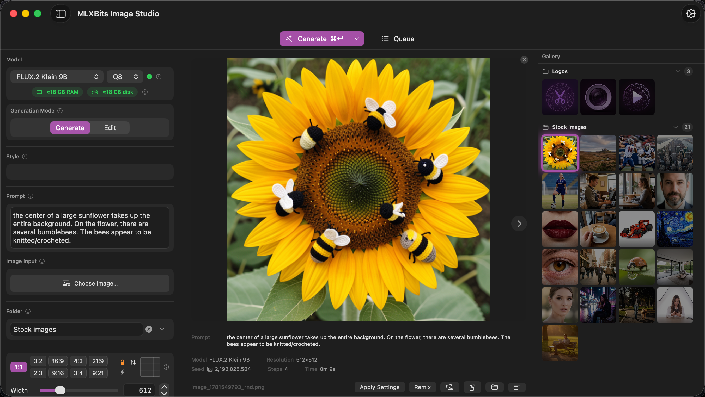
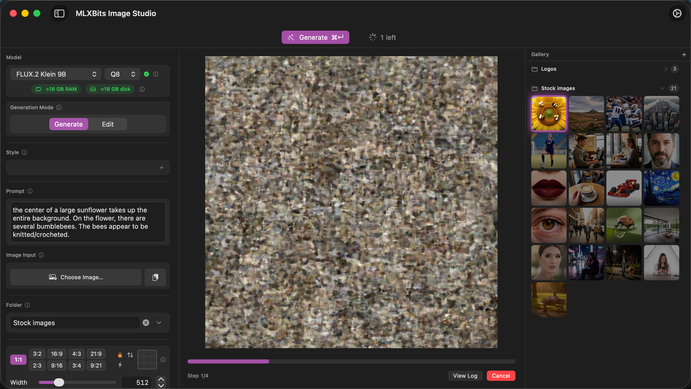
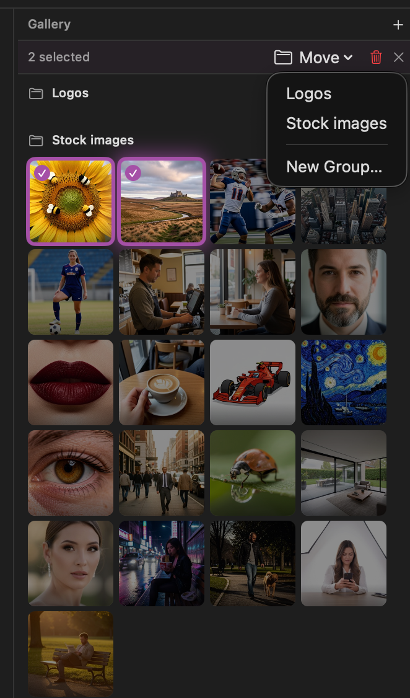
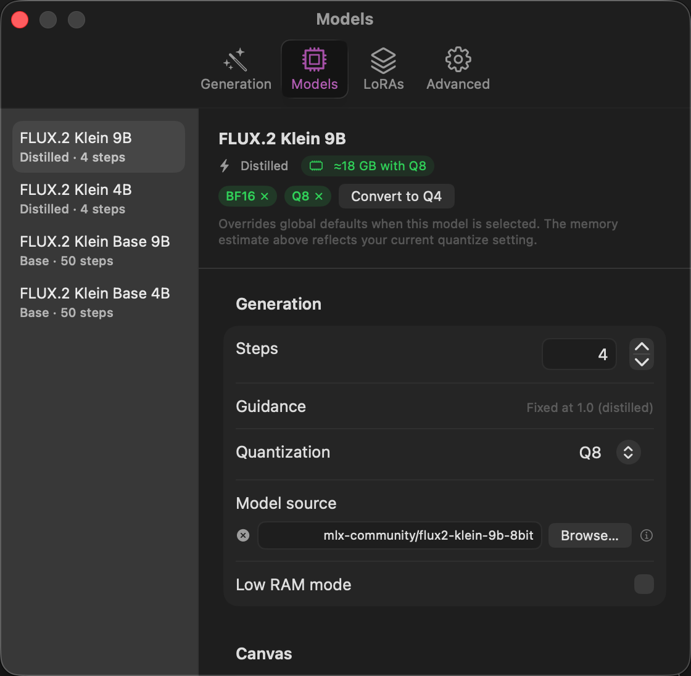

# MLXBits Image Studio

A native macOS Swift app for **FLUX and Ideogram 4 image generation** powered by [mflux](https://github.com/filipstrand/mflux) and Apple MLX. Queue jobs, watch generations unfold step-by-step, and browse your history — empower your creative workflow. No CLI needed, NOT yet another Electron container "app".

> **Requires macOS Tahoe 26.0+** and Apple Silicon M-series. [mflux](https://github.com/filipstrand/mflux) is installed automatically on first launch.

---

## Screenshots

<!-- Replace the placeholders below with actual screenshots before publishing. -->
<!-- Suggested shots:
     1. Full app window (params + live preview + gallery)
     2. ParamsPanel close-up (model picker, prompt, LoRA manager)
     3. Step-by-step live preview during generation
     4. Gallery with metadata panel open
     5. Settings → Model Defaults tab
-->

| Main window                                      | Live preview                                      |
| ------------------------------------------------ | ------------------------------------------------- |
|  |  |

| Gallery                                      | Settings                                      |
| -------------------------------------------- | --------------------------------------------- |
|  |  |

---

## Features

- **Text-to-image and image-to-image** generation via FLUX.2 Klein models
- **Ideogram 4** — structured-caption generation with a regional bounding-box layout editor and Gemma-assisted caption authoring (see [Ideogram 4](#ideogram-4) below)
- **Step-by-step live preview** — watch the image denoise in real time
- **Persistent job queue** — queue multiple jobs, they survive app restarts
- **Gallery** — scrollable history of every generation with thumbnail cache and metadata sidecars
- **LoRA support** — add any number of LoRA adapters with per-adapter strength sliders
- **Batch generation** — run 1, 3, 5 or a custom count with auto-incrementing seeds
- **Shortcut Keys** - `Command + Enter` for one-shot generation, `Option + Command + Enter` for batch generation
- **Model defaults** — save per-model presets (steps, guidance, LoRAs, dimensions)
- **Prompt templates** — save and reuse favorite prompt fragments like lighting, camera style
- **Low-RAM mode** — streams transformer blocks to cut peak Metal memory ~75%
- **HuggingFace integration** — enter your HF token once (stored in Keychain); gated models download automatically

## Supported models

| Variant                     | Steps | Notes                                                                   |
| --------------------------- | ----- | ----------------------------------------------------------------------- |
| FLUX.2 Klein 4B (distilled) | 4     | Fastest                                                                 |
| FLUX.2 Klein 9B (distilled) | 4     | Best quality/speed trade-off                                            |
| FLUX.2 Klein 4B (base)      | ~50   | Full diffusion                                                          |
| FLUX.2 Klein 9B (base)      | ~50   | Full diffusion                                                          |
| Ideogram 4                  | preset | Structured-caption model; FP8/Q8/Q4 precision selector (gated repo — accept terms on HuggingFace) |
| Custom                      | any   | Any HuggingFace repo ID or local path (only Flux.2 compatible, for now) |

---

## Ideogram 4

Ideogram 4 is a structured-caption model: instead of a single prompt string it
takes a JSON caption describing a high-level scene, an optional style block, and
a compositional breakdown of regional elements (each with an optional bounding
box and color palette).

- **Caption editor** — author the structured caption in a sectioned form, or let
  Gemma turn a plain description into a full caption (`mlx_lm` runs locally via
  `uv`; no API key).
- **Bounding-box layout editor** — drag, resize, and color regional elements on a
  canvas overlaid on the output aspect ratio.
- **Color palettes** — per-element and per-style palettes with editable hex entry,
  so an exact color can be reused across elements.
- **Precision** — FP8 / Q8 / Q4 selector. Q8/Q4 load pre-quantized MLX weights
  directly; FP8 quantizes once via `mflux-save`.

> **mflux support:** Ideogram 4 generation drives the `mflux-generate-ideogram4`
> CLI. Until Ideogram 4 support lands in a published mflux release, the app shows
> a "binary not found" error for Ideogram 4 jobs while the rest of the app
> (FLUX) works normally. The model is gated on HuggingFace — accept the terms on
> the model page before first download.

---

## Requirements

| Requirement   | Version     |
| ------------- | ----------- |
| macOS         | Tahoe 26.0+ |
| Apple Silicon | M1 or later |

mflux and uv are installed automatically on first launch if not already present. A progress banner appears at the top of the window while the install runs — no manual setup required.

---

## Installation

Download the latest `MLXBits_Image_Studio_<version>.dmg` from [Releases](../../releases), open it, and drag **MLXBits Image Studio** to `/Applications`.

The app is notarized/signed by Apple, so it should launch without any Gatekeeper prompt.

---

Like the app? Support me by [buying me a coffee](https://ko-fi.com/mlxbits). :) Your support helps keep my apps and other content free.

## Building from source

Requirements: Xcode 26+, [XcodeGen](https://github.com/yonaskolb/XcodeGen), [SwiftLint](https://github.com/realm/SwiftLint), [SwiftFormat](https://github.com/nicklockwood/SwiftFormat).

```bash
brew install xcodegen swiftlint swiftformat

git clone https://github.com/MLXBits/image-studio
cd mlxbits-image-studio

# Generate the Xcode project
xcodegen generate

# Open and build in Xcode
open "MLXBits Image Studio.xcodeproj"
```

> **Signing:** Set `DEVELOPMENT_TEAM` in `project.yml` to your 10-character Apple Developer Team ID before building a signed Release. Debug builds are unsigned and work without a Team ID.

---

## Creating a signed release DMG

```bash
# 1. Store notarytool credentials once
xcrun notarytool store-credentials "notarytool" \
  --apple-id "your@email.com" \
  --team-id YOUR_TEAM_ID \
  --password "xxxx-xxxx-xxxx-xxxx"   # app-specific password from appleid.apple.com

# 2. Set your Team ID (10-char string from developer.apple.com → Membership)
export DEVELOPMENT_TEAM=YOUR_TEAM_ID
# or store it in a gitignored .env file:  echo "DEVELOPMENT_TEAM=YOUR_TEAM_ID" > .env && source .env

# 3. Run the release script
./release.sh 0.1.0
# → build/MLXBits_Image_Studio_0.1.0.dmg (notarized + stapled)
```

---

## Project layout

```
App/           App entry point and root layout
Models/        Data models (FluxJob, Ideogram4Job, IdeogramCaption, LoraEntry, catalog)
Runner/        FluxJobRunner + Ideogram4JobRunner — spawn mflux subprocess, stream output
               (shared subprocess/stepwise plumbing in RunnerSupport)
Stores/        AppSettings, JobStore, Ideogram4JobStore, GalleryStore (Observable state)
Views/         SwiftUI views (ParamsPanel, PreviewPane, Gallery, Queue, Settings, Ideogram4)
Utilities/     KeychainHelper, MetadataSidecar, IdeogramCaptionGenerator, progress parser
Tests/         Swift Testing unit tests (RunnerSupport, BBoxGeometry, caption JSON, hex color)
Resources/     Info.plist, entitlements
project.yml    XcodeGen source of truth (never edit .xcodeproj directly)
release.sh     Archive → notarize → DMG pipeline
```
